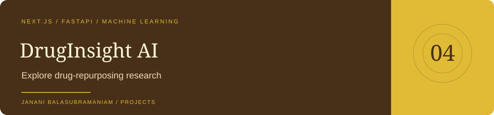

<a href="https://github.com/Janani-Balasubramanian">GitHub profile</a> · <a href="https://github.com/Janani-Balasubramanian/portfolio">Portfolio</a> · <a href="https://github.com/Janani-Balasubramanian/druginsight-ai/issues">Issues</a>

# DrugInsight AI

An academic research prototype for exploring drug-repurposing candidates, drug-target relationships, and model explanations. The application combines a Next.js interface, FastAPI backend, MongoDB storage, and a scikit-learn baseline.

> Computational research only. Predictions are not clinical evidence, medical advice, or prescriptions.

## Explore the project

| Area | Entry point |
| --- | --- |
| Setup, environment variables, API reference | [Detailed project guide](druginsight-ai/README.md) |
| Frontend | [Next.js application](druginsight-ai/frontend/) |
| Backend | [FastAPI application](druginsight-ai/backend/) |
| Data | [Research dataset](druginsight-ai/datasets/drug_disease_pairs.csv) |

## Capabilities in the project

Drug search, disease analysis, repurposing analysis, SHAP explanations, drug comparison, prediction history, and model metrics are represented in the application structure. The API initializes its model and MongoDB connection at startup.

## Start here

The application lives inside the **`druginsight-ai/` subdirectory**. Follow the [installation guide](druginsight-ai/README.md#installation) from that directory; it documents the separate backend and frontend processes and required configuration.

## Research boundaries

The included dataset is a baseline for experimentation. Model outputs need independent validation and do not replace laboratory experiments or clinical evaluation. The existing technical guide and its limitations are preserved in the application directory.
